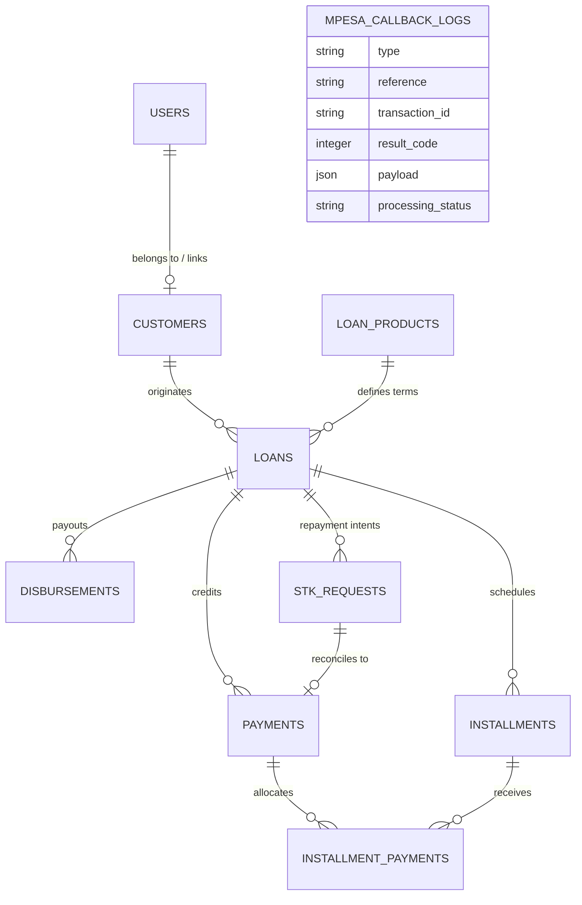

# 💳 Demulla Loan Management & M-Pesa Reconciliation System

A production-grade, full-stack **Loan Management System (LMS)** engineered with **Laravel 12**, **Inertia.js (Vue 3)**, and **PostgreSQL / MySQL / SQLite**, featuring real-time **Safaricom Daraja M-Pesa** integration (B2C Payouts & STK Push Repayments) and an **idempotent, tokenized ledger reconciliation engine**.

---

## 📑 Table of Contents
1. [Architecture & Technical Highlights](#-architecture--technical-highlights)
2. [The Core Problem: Reconciliation Without Relying on Safaricom's Identifiers](#-the-core-problem-reconciliation-without-relying-on-safaricoms-identifiers)
3. [Loan Product Engine: Flat vs. Reducing Balance](#-loan-product-engine-flat-vs-reducing-balance)
4. [State Machine Lifecycle](#-state-machine-lifecycle)
5. [Prerequisites & System Requirements](#-prerequisites--system-requirements)
6. [Step-by-Step Quickstart Guide](#-step-by-step-quickstart-guide)
7. [Default Seeded Credentials](#-default-seeded-credentials)
8. [Automated Test Suite & Verification](#-automated-test-suite--verification)
9. [Developer Webhook Sandbox & Simulation](#-developer-webhook-sandbox--simulation)
10. [Database Schema & Data Model](#-database-schema--data-model)

---

## 🏗 Architecture & Technical Highlights

* **Domain-Driven Service Architecture**: Encapsulates business operations inside dedicated domain services (`LoanService`, `DisbursementService`, `ReconciliationService`, and `DarajaService`).
* **ACID & Financial Precision**: All ledger operations, balance decrements, disbursement transitions, and schedule generation run inside atomic database transactions (`DB::transaction`) protected by pessimistic row locks (`lockForUpdate()`).
* **Multi-Identifier Authentication**: Users can register with optional email and sign in flexibly using **Phone Number** (`07XXXXXXXX` or `2547XXXXXXXX`), **National ID Number**, or **Email Address**.
* **Auditability & Webhook Persistence**: Every incoming webhook payload (STK Push & B2C Disbursals, including timeouts and user cancellations) is permanently stored in the `mpesa_callback_logs` database table.

---

## 🎯 The Core Problem: Reconciliation Without Relying on Safaricom's Identifiers

### The Constraint
> *Do not build matching logic around Safaricom's internal identifiers (`MerchantRequestID`, `CheckoutRequestID`, `ConversationID`) as the primary key back to a loan account.*

### Our Solution & Defensive Design

```
┌─────────────────────────────────────────────────────────────────────────────┐
│ 1. Customer initiates Repayment (e.g. KES 5,000)                             │
└──────────────────────────────────────┬──────────────────────────────────────┘
                                       │
                                       ▼
┌─────────────────────────────────────────────────────────────────────────────┐
│ 2. System generates internal cryptographic UUID: `checkout_reference`      │
│    Saves in `stk_requests` table with status: `pending`, tied to `loan_id`  │
└──────────────────────────────────────┬──────────────────────────────────────┘
                                       │
                                       ▼
┌─────────────────────────────────────────────────────────────────────────────┐
│ 3. Pushes STK Push to Safaricom with parameterized callback URL:            │
│    `https://your-domain.com/api/daraja/stk-callback/{checkout_reference}`   │
└──────────────────────────────────────┬──────────────────────────────────────┘
                                       │
                                       ▼
┌─────────────────────────────────────────────────────────────────────────────┐
│ 4. Safaricom invokes Webhook Endpoint with `{checkout_reference}` in path   │
│    System retrieves exact `stk_requests` record via INTERNAL UUID token     │
│    (Safaricom transaction IDs are stored solely as secondary audit metadata)│
└──────────────────────────────────────┬──────────────────────────────────────┘
                                       │
                                       ▼
┌─────────────────────────────────────────────────────────────────────────────┐
│ 5. Atomic Waterfall Ledger Allocation:                                      │
│    Applies funds across unpaid installments in chronological order           │
└─────────────────────────────────────────────────────────────────────────────┘
```

### Edge Case Mitigations

| Edge Case | Failure Mode in Naive Systems | Our Architectural Defense |
|---|---|---|
| **Webhook Delivery Replays / Duplicates** | Double-crediting customer balances; duplicate installment marked paid. | Uses `lockForUpdate()` inside a `DB::transaction`. Checks `stkRequest.status !== 'pending'`. If already processed, idempotently logs and ignores re-execution. |
| **Missing / Delayed Callbacks** | Indefinite hang or lost payment intent. | Repayment intent is stored as `pending` with timestamps. Balances are never adjusted until cryptographic confirmation arrives. Raw callbacks are permanently persisted in `mpesa_callback_logs`. |
| **Amount Mismatch (Over/Underpayment)** | Accounting discrepancy, broken schedule. | Compares actual `Amount` paid against `amount_requested`. If mismatched, marks request `status = 'mismatched'` while accurately allocating the exact received funds to the ledger. |
| **Simultaneous Payment Collisions** | Two customers paying the same amount at the same second collide. | Each request generates an isolated UUID token tied directly to `loan_id`. Collisions are mathematically impossible. |

---

## 🧮 Loan Product Engine: Flat vs. Reducing Balance

The system provides two calculation models configured on reusable loan product templates:

### 1. Flat Interest Rate
* **Formula**: $\text{Total Interest} = \text{Principal} \times \text{Rate} \times \text{Term}$
* **Use Case**: Micro-loans, salary advances, and short-term credit.
* **Allocation**: Evenly distributes principal and interest across all installments, with automated rounding discrepancy balancing applied to the final installment.

### 2. Reducing Balance (Amortized PMT)
* **Formula**: Standard financial annuity payment formula:
  $$\text{PMT} = P \times \frac{r(1+r)^n}{(1+r)^n - 1}$$
* **Use Case**: SME working capital, asset financing, and long-term loans.
* **Allocation**: Calculates periodic interest based on remaining unpaid principal balance ($I_t = B_{t-1} \times r$), decreasing interest portions and increasing principal portions over the term.

---

## 🔄 State Machine Lifecycle

```
             ┌───────────┐
             │  PENDING  │  (Customer applies / Admin origination)
             └─────┬─────┘
                   │
         ┌─────────┴─────────┐
         ▼                   ▼
   ┌───────────┐       ┌───────────┐
   │ REJECTED  │       │ APPROVED  │  (Admin review; timestamped `approved_at`)
   └───────────┘       └─────┬─────┘
                             │
                             ▼ (Admin triggers "Disburse" via Daraja B2C)
                       ┌───────────┐
                       │  ACTIVE   │  (`disbursed_at` set; Installment schedule goes LIVE)
                       └─────┬─────┘
                             │ (Customer makes repayments via STK Push)
                             ▼
                       ┌───────────┐
                       │  CLOSED   │  (Principal + Interest balance reaches 0.00)
                       └───────────┘
```

---

## 💻 Prerequisites & System Requirements

Ensure you have the following installed on your development machine:
* **PHP**: `>= 8.2` (with `pdo`, `openssl`, `mbstring`, `curl`, `sqlite3` or `pdo_pgsql` extensions)
* **Composer**: `>= 2.5`
* **Node.js**: `>= 18.0` & **NPM**: `>= 9.0`
* **Database**: PostgreSQL / MySQL / SQLite

---

## 🚀 Step-by-Step Quickstart Guide

### 1. Clone the Repository
```bash
git clone <repository-url> loan_management_system
cd loan_management_system
```

### 2. Install PHP & Node Dependencies
```bash
composer install
npm install
```

### 3. Environment Configuration
Copy the example environment file and generate the application encryption key:
```bash
cp .env.example .env
php artisan key:generate
```

Configure your database connection in `.env` (SQLite or PostgreSQL / MySQL):
```ini
DB_CONNECTION=sqlite
# Or for PostgreSQL / MySQL:
# DB_CONNECTION=pgsql
# DB_HOST=127.0.0.1
# DB_PORT=5432
# DB_DATABASE=loan_management_system
# DB_USERNAME=postgres
# DB_PASSWORD=secret
```

### 4. Run Migrations & Seed Database
Run migrations and database seeders to populate demo products, admin accounts, and customer accounts:
```bash
php artisan migrate --seed
```

### 5. Build Assets / Start Development Server
Build the frontend production bundle:
```bash
npm run build
```

Start the Laravel development server:
```bash
php artisan serve
```

Access the application in your browser at: **`http://127.0.0.1:8000`**

---

## 🔑 Default Seeded Credentials

The database seeder automatically creates test accounts with pre-configured passwords (`password`):

| Role | Name | Login (Email / Phone / National ID) | Password |
|---|---|---|---|
| **System Administrator** | Admin User | `admin@example.com` | `password` |
| **Borrower / Customer** | John Doe | `john@example.com` <br> `0712345678` <br> `12345678` | `password` |
| **Borrower / Customer** | Jane Smith | `jane@example.com` <br> `0787654321` <br> `87654321` | `password` |

> 💡 **Multi-Identifier Login**: Customers can sign in using their **Email**, **Phone Number** (local format e.g. `0712345678` or international format `254712345678`), or **National ID Number**.

---

## 🧪 Automated Test Suite & Verification

The project includes an end-to-end automated test suite covering authentication, loan origination, B2C disbursement lifecycle, STK Push reconciliation, and edge-case handling:

### Run All Tests:
```bash
php artisan test
```

### Key Test Suites:
* **[DisbursementTest.php](file:///c:/wamp64/www/apps/loan_management_system/tests/Feature/DisbursementTest.php)**: Verifies atomic B2C payout initiation, direct loan activation, installment schedule generation, and fallback webhook receipt reconciliation.
* **[ReconciliationTest.php](file:///c:/wamp64/www/apps/loan_management_system/tests/Feature/ReconciliationTest.php)**: Tests installment waterfall allocation, partial payments, idempotency against duplicate callback replays, and full loan closure.
* **[AuthenticationTest.php](file:///c:/wamp64/www/apps/loan_management_system/tests/Feature/Auth/AuthenticationTest.php)**: Tests multi-identifier login (Phone, Email, ID Number).
* **[RegistrationTest.php](file:///c:/wamp64/www/apps/loan_management_system/tests/Feature/Auth/RegistrationTest.php)**: Tests customer onboarding with and without optional email.

---

## 🛠 Developer Webhook Sandbox & Simulation

If you are assessing or testing the system in an environment without active Daraja sandbox credentials or external tunneling (e.g. ngrok), the system includes a built-in **Developer Webhook Sandbox Panel** in the UI:

1. **Disbursement Simulation**:
   - Navigate to an approved loan as Admin.
   - Click **Disburse Payout (M-Pesa B2C)**. The loan is immediately disbursed and activated.
   - Use the **Developer Webhook Sandbox** on the page to trigger simulated Safaricom callbacks (Success / Fail) to test webhook receipt reconciliation.
2. **Repayment Simulation**:
   - Navigate to an active loan in Customer Portal or Admin Workspace.
   - Click **Repay via M-Pesa STK Push**.
   - Use the **Repayment Webhook Simulator** on the page to simulate Safaricom callback outcomes (**Success**, **Mismatch**, or **User Cancelled**).
   - Observe real-time installment waterfall allocation and balance reduction.

---

## 📊 Database Schema & Data Model


